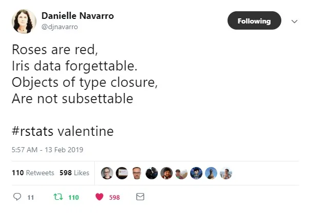

```{r setup, include=FALSE}
library(dplyr)
library(rlang)
library(palmerpenguins)
library(purrr)
library(ggplot2)

library(knitr)

options(crayon.enabled = FALSE)

```


class: inverse

<center>
<div class="hello">hi!</div>
</center>

---

class: inverse

# I'm Daniel
.pull-left[
.center[
</img>
]

PhD Student: Virginia Tech (Winter 2021)

- Data Science education & pedagogy
- Medical, Biomedical, Health Sciences
- [ds4biomed.tech](https://ds4biomed.tech)
]

.pull-right[
-  Inten at RStudio
  - [`gradethis`](https://github.com/rstudio-education/gradethis)
  - Code grader for [`learnr`](https://github.com/rstudio/learnr) documents
- The Carpentries
  - Instructor
  - Trainer
  - Community Maintainer Lead
- Author:
<center>
</img>
</center>
]

---

# Parts of Tidy Evaluation

1. Quasiquotation
  - Quotation
2. Quosures
  - Quotation
  - Closures
  - Environments
3. Data mask
  - Environments

<div class="my-footer"><span>https://github.com/chendaniely/rstatsdc-2020-tidyeval</span></div> 

---

# Learning Tidy Evaluation

- Using {`dplyr`} as an example
  - Something we are familiar with
- Really only using `dplyr::select()`

<div class="my-footer"><span>https://github.com/chendaniely/rstatsdc-2020-tidyeval</span></div> 

---

# The Famous Penguin Dataset

```{r}
library(palmerpenguins)
penguins
```

<div class="my-footer"><span>https://github.com/chendaniely/rstatsdc-2020-tidyeval</span></div> 

---

class: center, middle, inverse

# Selecting Columns

<div class="my-footer"><span>https://github.com/chendaniely/rstatsdc-2020-tidyeval</span></div> 

---

# Selecting columns: [row, col, drop]

.pull-left[
```{r}
head(penguins[, "species"]) # for tibble
```
]
.pull-right[
```{r}
head(penguins[, c("species", "island")])
```
]

```{r}
head(penguins[, "species", drop = FALSE]) # for data.frame
```

<div class="my-footer"><span>https://github.com/chendaniely/rstatsdc-2020-tidyeval</span></div> 
---

# Selecting columns: `$`, `drop=TRUE`

```{r, results='hide'}
penguins$species
```

```{r}
penguins[, "species", drop = TRUE]
```

<div class="my-footer"><span>https://github.com/chendaniely/rstatsdc-2020-tidyeval</span></div> 

---

# Selecting columns: `base::subset()`

.pull-left[
```{r}
base::subset(
  penguins,
  select = species)
```
]
.pull-right[
```{r}
base::subset(
  x = penguins,
  select = c(species, bill_length_mm))
```
]

<div class="my-footer"><span>https://github.com/chendaniely/rstatsdc-2020-tidyeval</span></div> 

---

# Selecting columns: `dplyr::select()`

.pull-left[
```{r}
dplyr::select(penguins, species)
```
]
.pull-right[
```{r}
penguins %>%
  dplyr::select(species, bill_length_mm)
```
]

<div class="my-footer"><span>https://github.com/chendaniely/rstatsdc-2020-tidyeval</span></div> 

---

# Selecting columns: index position

.pull-left[
```{r}
penguins[, 1, drop = FALSE]
```
]
.pull-right[
```{r}
penguins[, c(1, 3, 5)]
```
]

<div class="my-footer"><span>https://github.com/chendaniely/rstatsdc-2020-tidyeval</span></div> 

---

class: center, middle, inverse

# Quasiquotation

What is quoting?

<div class="my-footer"><span>https://github.com/chendaniely/rstatsdc-2020-tidyeval</span></div> 

---

# What is an expression

.pull-left[
The code you write that R interprets and evaluates
```{r}
3 + 3
```

Only code you write
```{r}
quote(3 + 3)
```
]
.pull-right[
Lazy evaluation: the `3+3` isn't evaluated right away
```{r}
ex <- quote(3 + 3)
ex
```

```{r}
eval(ex)
```
]

Think of quoting as the strin representation of your code.
It's not really a string, but it's a reasonable approximation.

<div class="my-footer"><span>https://github.com/chendaniely/rstatsdc-2020-tidyeval</span></div> 

---

# Using {rlang}

.pull-left[
```{r}
rlang::expr(3 + 3)
```

```{r}
ex <- rlang::expr(3 + 3)
ex
```
]
.pull-right[
```{r}
eval(ex)
```

```{r}
rlang::eval_tidy(ex)
```
]

<div class="my-footer"><span>https://github.com/chendaniely/rstatsdc-2020-tidyeval</span></div> 

---

# Expressions: call, symbol, constant, pairlist

```{r}
ex <- quote(3 + 3)
str(ex)
```

```{r}
ex <- quote(3)
str(ex)
```

```{r}
ex <- quote(species)
str(ex)
```

<div class="my-footer"><span>https://github.com/chendaniely/rstatsdc-2020-tidyeval</span></div> 

---

# Selecting columns

.pull-left[
Direct string column
```{r}
penguins[, "species"]
```
]

.pull-right[
Passing a variable

```{r}
col <- "species"
penguins[, col]
```
]

<div class="my-footer"><span>https://github.com/chendaniely/rstatsdc-2020-tidyeval</span></div> 

---

# Selecting columns: Variables need to exist

```{r, error=TRUE}
penguins[, species]
``` 

<div class="my-footer"><span>https://github.com/chendaniely/rstatsdc-2020-tidyeval</span></div> 

---

# Selecting: tibble specific (tibble)

.pull-left[
```{r}
as.name("species")
```
]

.pull-right[
```{r}
quote(species)
```
]


.pull-left[
```{r}
penguins[, as.name("species")]
```
]

.pull-right[
```{r}
penguins[, quote(species)]
```
]

<div class="my-footer"><span>https://github.com/chendaniely/rstatsdc-2020-tidyeval</span></div> 

---

# Selecting: tibble specific (data.frame)

```{r, error=TRUE}
iris[, as.name("Species")]
```

```{r, error=TRUE}
iris[, quote(Species)]
```

<div class="my-footer"><span>https://github.com/chendaniely/rstatsdc-2020-tidyeval</span></div> 

---

# `my_select`: try 1

.pull-left[
```{r}
my_select <- function(data, col) {
  return(
    data[, col, drop = FALSE] #<<
  )
}
```

```{r}
my_select(penguins, "species")
```
]

.pull-right[
```{r}
# remeber this is tibble input specific
my_select(penguins, quote(species))
```
]

<div class="my-footer"><span>https://github.com/chendaniely/rstatsdc-2020-tidyeval</span></div> 

---
# `my_select`: try 1 needs to quote

```{r, error=TRUE}
my_select(penguins, species)
```

<div class="my-footer"><span>https://github.com/chendaniely/rstatsdc-2020-tidyeval</span></div> 

---

# `my_select`: try 2

### Oh! I just learned how to quote inputs!

```{r}
my_select <- function(data, col) {
  return(
    data[, quote(col), drop = FALSE] #<<
  )
}
```

### Nope!

We need a way to capture what the user passed, not the function parameter name.

```{r, error=TRUE}
my_select(penguins, species) # quote passed in col, not species
```

<div class="my-footer"><span>https://github.com/chendaniely/rstatsdc-2020-tidyeval</span></div> 

---

# {rlang} enriched expression

Use `rlang::expr()` to capture expressions outside of a function

Use `rlang::enexpr()` to capture expression **inside** a function

.pull-left[
```{r}
ex <- rlang::expr(x)
ex
```

```{r}
fexpr <- function(x) {
  rlang::expr(x) #<<
}
fexpr(hello)
```
]

.pull-right[
```{r}
fenexpr <- function(x) {
  rlang::enexpr(x) #<<
}
fenexpr(hello)
```
]

<div class="my-footer"><span>https://github.com/chendaniely/rstatsdc-2020-tidyeval</span></div> 

---

# `my_select`: try 3

.pull-left[
```{r}
my_select <- function(data, col) {
  return(
    data[, rlang::enexpr(col), drop = FALSE] #<<
  )
}
```

```{r}
my_select(penguins, species)
```
]

.pull-right[
```{r}
my_select <- function(data, col) {
  col <- rlang::enexpr(col) #<<
  return(
    data[, col, drop = FALSE] #<<
  )
}
```

```{r}
my_select(penguins, species)
```
]

<div class="my-footer"><span>https://github.com/chendaniely/rstatsdc-2020-tidyeval</span></div> 

---

# `my_select`: try 3 on `data.frame`

```{r, error=TRUE}
my_select(iris, Species)
```

### Remember how we can select on index positions?

<div class="my-footer"><span>https://github.com/chendaniely/rstatsdc-2020-tidyeval</span></div> 

---

# `my_select`: try 4

```{r}
my_select <- function(data, col) {
  col <- rlang::enexpr(col)
  idx <- which(names(data) %in% as.character(col)) # create an index #<<
  return(
    data[, idx, drop = FALSE]                      # subset on the index #<<
  )
}
```

.pull-left[
Works on a `tibble`
```{r}
my_select(penguins, species)
```

]

.pull-right[
Works on a `data.frame`
```{r}
my_select(iris, Species)
```

]

<div class="my-footer"><span>https://github.com/chendaniely/rstatsdc-2020-tidyeval</span></div> 

---

# `dplyr::select` source code

.pull-left[
```{r, eval=FALSE}
select <- function(.data, ...) {
  UseMethod("select")
}
```

```{r, eval=FALSE}
select.data.frame <- function(.data, ...) {
  loc <- tidyselect::eval_select(expr(c(...)), .data)
  loc <- ensure_group_vars(loc, .data, notify = TRUE) #<<

  dplyr_col_select(.data, loc, names(loc)) #<<
}
```

```{r, eval=FALSE}
dplyr_col_select <- function(.data, loc, names = NULL) {
  loc <- vec_as_location(loc, n = ncol(.data), names = names(.data)) #<<
  ...
  ...
}
```

]

.pull-right[
```{r, eval=FALSE}
ensure_group_vars <- function(loc, data, notify = TRUE) {
  group_loc <- match(group_vars(data), names(data)) #<<
  missing <- setdiff(group_loc, loc)

  if (length(missing) > 0) {
    vars <- names(data)[missing]
    if (notify) {
      inform(glue(
        "Adding missing grouping variables: ",
        paste0("`", names(data)[missing], "`", collapse = ", ")
      ))
    }
    loc <- c(set_names(missing, vars), loc)
  }

  loc
}
```

]

<div class="my-footer"><span>https://github.com/chendaniely/rstatsdc-2020-tidyeval</span></div> 

---

# `my_selct`: try 5: more variables `...`

`enexpr` for a single variable, `enxprs` for multiple variables

```{r}
my_select <- function(data, ...) {
  cols <- rlang::enexprs(...)                      # the "s" for plural = multiple things #<<
  cols_char <- as.vector(cols, mode = "character") #<<
  idx <- which(names(data) %in% cols_char)
  return(
    data[, idx, drop = FALSE]
  )
}

```

.pull-left[
```{r}
my_select(penguins, species, year, island)
```
]
.pull-right[
```{r}
my_select(iris, Species, Petal.Width)
```

]


<div class="my-footer"><span>https://github.com/chendaniely/rstatsdc-2020-tidyeval</span></div> 

---

# `my_select`: try 6: `match` not `which`

```{r}
my_select <- function(data, ...) {
  cols <- rlang::enexprs(...)
  cols_char <- as.vector(cols, mode = "character")
  idx <- match(cols_char, names(data)) #<<
  return(
    data[, idx, drop = FALSE]
  )
}

```

.pull-left[
```{r}
my_select(penguins, species, year, island)
```
]
.pull-right[
```{r}
my_select(iris, Species, Petal.Width)
```

]

<div class="my-footer"><span>https://github.com/chendaniely/rstatsdc-2020-tidyeval</span></div> 

---

# Quasiquotation: ...-quote-unquote-quote...

In the last try we had:

```{r}
my_select <- function(data, ...) {
  cols <- rlang::enexprs(...)                      # handle the "weirdness" #<<
  cols_char <- as.vector(cols, mode = "character") # unquote the arguments #<<
  idx <- match(cols_char, names(data))             # do regular R things #<<
  return(
    data[, idx, drop = FALSE]
  )
}
```


<div class="my-footer"><span>https://github.com/chendaniely/rstatsdc-2020-tidyeval</span></div> 

---

# Variables, quoted, unquoted

```{r}
col_name <- "species"
```

.pull-left[
```{r}
penguins[, c(col_name, "island", "year")]
```
]

.pull-right[
```{r}
penguins %>%
  dplyr::select(col_name, island, year)
```
]

<div class="my-footer"><span>https://github.com/chendaniely/rstatsdc-2020-tidyeval</span></div> 

---

# Variables, quoted, unquoted: `my_select`

.pull-left[
Subsets quoted variables
```{r}
my_select(penguins, island, year)
```
]

Does not work for unquoted variables.

We want `col_name` to be `species`
```{r, error=TRUE}
my_select(penguins, col_name, island, year)
```

<div class="my-footer"><span>https://github.com/chendaniely/rstatsdc-2020-tidyeval</span></div> 

---

# The problem

Need a way to treat the variable as the variable not as the quoted term

### That is...

- Want to unquote `col_name` since the input is automatically quoted using `enexprs`
- Want to replace `col_name` with `species`

### Solution

For a single variable we use `!!col_name` to unquote `col_name`

<div class="my-footer"><span>https://github.com/chendaniely/rstatsdc-2020-tidyeval</span></div> 

---

# bang-bang `!!`

```{r}
col_name <- "species"
```


.pull-left[
```{r}
penguins %>%
  my_select("island", "year")
```
]

.pull-right[
```{r}
penguins %>%
  my_select(!!col_name, island, "year")
```

]

<div class="my-footer"><span>https://github.com/chendaniely/rstatsdc-2020-tidyeval</span></div> 

---

# How to know if a function quotes inputs?

If you pass in the arguments into the function and it works

.pull-left[
```{r}
my_select(penguins, island) %>% head(3)
```
]

.pull-right[
```{r}
library(rlang)
```
]

but if you pass the argument outside the function and it fails

```{r, error=TRUE}
island
```

### `!!` unquoting: selective evalutation on parts of a quoted expression

<div class="my-footer"><span>https://github.com/chendaniely/rstatsdc-2020-tidyeval</span></div> 

---

# !!! is !! for ... 

.center[
```{r, echo=FALSE}

```
]

<div class="my-footer"><span>https://github.com/chendaniely/rstatsdc-2020-tidyeval</span></div> 

???

Similar to "unpacking" in Python (`*args`, `**kwargs`)

---

# !!!

.pull-left[
```{r}
cols <- exprs(species, island, year)
cols
```

```{r}
class(cols)
```

]

.pull-right[
```{r}
my_select(penguins, !!!cols)
```
]

```{r, error=TRUE}
my_select(penguins, cols)
```

<div class="my-footer"><span>https://github.com/chendaniely/rstatsdc-2020-tidyeval</span></div> 

---

# {`dplyr`} has one more check

```{r}
col_name <- "species"
```


.pull-left[
Bare variable name

```{r}
penguins %>%
  dplyr::select(col_name, island, year)
```

]
.pull-right[
Using `!!` to unquote the variable name

```{r}
penguins %>%
  dplyr::select(!!col_name, island, year)
```
]

<div class="my-footer"><span>https://github.com/chendaniely/rstatsdc-2020-tidyeval</span></div> 

---


class: center, middle, inverse

# Quosures = quote + closure

<div class="my-footer"><span>https://github.com/chendaniely/rstatsdc-2020-tidyeval</span></div> 

---

# Closure?!

.pull-left[
```{r, echo=FALSE}

```
]


```{r, error=TRUE}
df[1]
```

<hr>

`df()` is actually a function in `stats::df()`. You can't subset a function.

- Closure = "thing" (e.g., a function, expression) + environment

<div class="my-footer"><span>https://github.com/chendaniely/rstatsdc-2020-tidyeval</span></div> 

---

# Environments

.pull-left[
```{r}
e <- new.env()
e$x <- 3
```

```{r}
e$x
```

```{r, error=TRUE}
x
```
]
.pull-right[
```{r, error=TRUE}
eval(quote(3 + x))
```

```{r}
eval(quote(3 + x), envir = e)
```
]

<div class="my-footer"><span>https://github.com/chendaniely/rstatsdc-2020-tidyeval</span></div> 
---

# Formulas aren't just for models

.pull-left[
```{r}
~ 3 + 3
```

```{r}
form <- ~ 3 + 3
form
```

```{r}
attributes(form)
```
]

.pull-righ[
Extract parts of the formula

```{r}
form[[1]]
```

```{r}
form[[2]]
```

Evaluate the expression of he formula

```{r}
eval(form[[2]])
```
]

<div class="my-footer"><span>https://github.com/chendaniely/rstatsdc-2020-tidyeval</span></div> 

---

# Formulas = expression + environment

.pull-left[
```{r}
form <- ~ 3 + x
form[[1]]
```

```{r}
form[[2]]
```

```{r}
environment(form)
```
]

.pull-right[
```{r}
e <- new.env()
e$x <- 10
environment(form) <- e #<<
```

```{r}
eval(expr = form[[2]],
     envir = environment(form)) #<<
```

```{r, error=TRUE}
eval(expr = form[[2]]) # no x in .GlobalEnv
```
]

<div class="my-footer"><span>https://github.com/chendaniely/rstatsdc-2020-tidyeval</span></div> 

---

# Quosure = expression + environment

.pull-left[
- We can program with quosures easier than  `~`
  - Allows quasiquotation
  - User facing: `~`
  - Developer facing: quosures

```{r}
form <- ~ 3 + x
e <- rlang::env(x = 10)
environment(form) <- e
```

```{r}
eval(expr = form[[2]],
     envir = environment(form))
```
]
.pull-right[
```{r}
q <- rlang::new_quosure(
  expr = rlang::expr(3 + x),
  env = e)
```

```{r}
rlang::eval_tidy(q) # uses the quosure env
```

<hr>

Quosures are subclass of formulas

```{r}
class(q) # subclass of formula
```
]

<div class="my-footer"><span>https://github.com/chendaniely/rstatsdc-2020-tidyeval</span></div> 

---

# Quosures in practice

- In practice we use `enquo()` and `enquos()` within a function definition
  - Remember the `en-` prefix for "**en**riched" which does the quoting from function arguments
- `quo()`, `quos()`, and `new_quosure()` exist for completeness

<div class="my-footer"><span>https://github.com/chendaniely/rstatsdc-2020-tidyeval</span></div> 

---

class: center, middle, inverse

# Data Masks

<div class="my-footer"><span>https://github.com/chendaniely/rstatsdc-2020-tidyeval</span></div> 

---

# Data mask

- An object (e.g., usually a dataframe, but can also be a list) where the expression goes to look for values
- Data mask values **superceed** values in the environment

<div class="my-footer"><span>https://github.com/chendaniely/rstatsdc-2020-tidyeval</span></div> 

---

# Quosure + Data Mask example

.pull-left[
```{r}
q1 <- rlang::new_quosure(rlang::expr(x * y),
                         rlang::env(x = 100))
q1
```

```{r}
df <- data.frame(y = 1:5)
df
```
]

.pull-right[
```{r}
rlang::eval_tidy(expr = q1,
                 data = df)
# uses the quosure's env
```

<hr>

```{r, error=TRUE}
x * y
```

```{r, error=TRUE}
100 * y
```

```{r}
100 * df$y
```
]

<div class="my-footer"><span>https://github.com/chendaniely/rstatsdc-2020-tidyeval</span></div> 

---

#  `my_select`: previous try

```{r}
col_name <- "species"
```

```{r}
my_select <- function(data, ...) {
  cols <- rlang::enexprs(...)                      # handle the "weirdness"
  cols_char <- as.vector(cols, mode = "character") # unquote the arguments
  idx <- match(cols_char, names(data))             # find index positions
  return(
    data[, idx, drop = FALSE]                      # regular R things: subset on index
  )
}
```

```{r, error=TRUE}
my_select(penguins, col_name, year, "island")
```

<div class="my-footer"><span>https://github.com/chendaniely/rstatsdc-2020-tidyeval</span></div> 

---

#  `my_select`:try 7 quosures + data mask

```{r}
my_select <- function(data, ...) {
  cols <- rlang::enquos(...)                               # handle the "weirdness"
  
  vars <- as.list(set_names(seq_along(data), names(data))) # list of columns and their index #<<
  col_char_num <- purrr::map(cols, rlang::eval_tidy, vars) # tidy evaluate the user inputs #<<
  idx <- purrr::map_int(col_char_num,                      # get index based on user input cols
                        function(x){ifelse(is.character(x),
                                           vars[[x]],
                                           x)}) 
  return(
    data[, idx, drop = FALSE]                              # regular R things: subset on index
  )
}
```

```{r, error=TRUE}
my_select(penguins, col_name, year, "island")
```

<div class="my-footer"><span>https://github.com/chendaniely/rstatsdc-2020-tidyeval</span></div> 

---

# In general...

`dplyr::select()`, `dplyr::arrange()`, { `tidyselect` }

- Getting the index position of the columns

```{r}
idx <- c(1, 3, 2, 6, 1)
```

- Subsetting using base R on those index positions

```{r}
penguins[, idx, drop = FALSE]
```

<div class="my-footer"><span>https://github.com/chendaniely/rstatsdc-2020-tidyeval</span></div> 

---

class: center, middle, inverse

# What I didn't cover

<div class="my-footer"><span>https://github.com/chendaniely/rstatsdc-2020-tidyeval</span></div> 

---

class: center, middle, inverse

# A lot...

<div class="my-footer"><span>https://github.com/chendaniely/rstatsdc-2020-tidyeval</span></div> 

---

# For example...

- `:=` "colon equal", let's you quote the left hand side of an equal sign
- `.data` and `.env` pronouns in a data mask
  - https://adv-r.hadley.nz/evaluation.html#pronouns

<div class="my-footer"><span>https://github.com/chendaniely/rstatsdc-2020-tidyeval</span></div> 

---

class: center, middle, inverse

# tl;dr

<div class="my-footer"><span>https://github.com/chendaniely/rstatsdc-2020-tidyeval</span></div> 

---

# User: string; Function: string

- What we are used to
- Use the string version or string parameter

.pull-left[
```{r}
my_func <- function(data, col) {
  return(
    ggplot(data = data,
           aes_string(x = col)) + #<<
      geom_bar()
  )
}
```
]

.pull-right[
```{r fig.height=1.5}
my_func(penguins, "year")
```
]

<div class="my-footer"><span>https://github.com/chendaniely/rstatsdc-2020-tidyeval</span></div> 

---

# User: string; Function: quote

1. Convert to expression
  - `base::parse()`
  - `rlang::parse_expr()`, `rlang::parse_exprs()`, `rlang::parse_quo()`, `rlang::parse_quos()`
2. Unquote expression

.pull-left[

```{r}
my_func <- function(data, col) {
  ex <- rlang::parse_expr(col) #<<
  return(
    ggplot(data = data,
           aes(x = !!ex)) + #<<
      geom_bar()
  )
}
```
]

.pull-right[

```{r fig.height=1.5}
my_func(penguins, "year")
```


```{r fig.height=1.5}
var <- "year"
my_func(penguins, var)
```
]

<div class="my-footer"><span>https://github.com/chendaniely/rstatsdc-2020-tidyeval</span></div> 

---

# User: quote; Function: string

- Capture expression: `rlang::enexpr()`
- Convert to string: `rlang::as_string()`

.pull-left[
```{r}
my_func <- function(data, col) {
  q <- rlang::enexpr(col)  #<<
  s <- rlang::as_string(q) #<<
  return(
    ggplot(data = data,
           aes_string(x = s)) + #<<
      geom_bar()
  )
}
```
]

.pull-right[
```{r fig.height=1.5}
my_func(penguins, year)
```
]

<div class="my-footer"><span>https://github.com/chendaniely/rstatsdc-2020-tidyeval</span></div> 

---

# User: quote; Function: quote

- `rlang::enquo()` + `!!`
- `{{ }}`

.pull-left[

```{r}
my_func <- function(data, col) {
  col_quo <- rlang::enquo(col) #<<
  return(
    ggplot(data = data,
           aes(x = !!col_quo )) + #<<
      geom_bar()
  )
}
```

```{r}
my_func <- function(data, col) {
  return(
    ggplot(data = data,
           aes(x = {{col}} )) + #<<
      geom_bar()
  )
}
```
]

.pull-right[
```{r fig.height=1.5}
my_func(penguins, year)

```
]

<div class="my-footer"><span>https://github.com/chendaniely/rstatsdc-2020-tidyeval</span></div> 

---

class: center, middle, inverse

# Thanks!

@chendaniely

Read, read, and re-read:: https://adv-r.hadley.nz/metaprogramming.html

Slides: https://github.com/chendaniely/rstatsdc-2020-tidyeval
